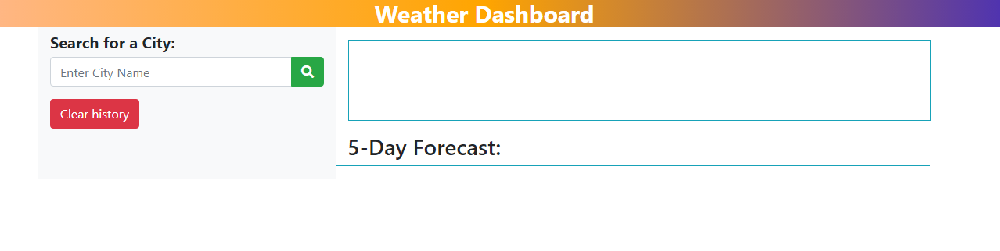

# Week-6-Weather-Search

# Table of contents
1. [Description](#description)
2. [Technologies used](#technologies-used)
3. [Screenshots](#screenshot)
4. [Website](#website)
5. [Contributors](#contributor)
6. [License](#license)

## Description
```
User Story

AS A traveler
I WANT to see the weather outlook for multiple cities
SO THAT I can plan a trip accordingly
```

## Technologies used
* Javascript
* Css
* HTML
* Bootstrap

## ScreenShot
* Screenshot:



## Website

https://gongtianchou.github.io/Work-Day-Scheduler/

## Contributor

* Tianchou Gong

## License
* [MIT License](https://choosealicense.com/licenses/mit/)